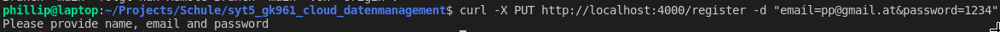
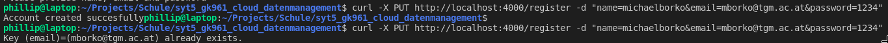
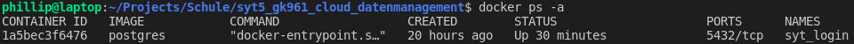
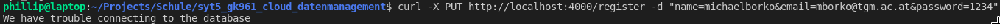
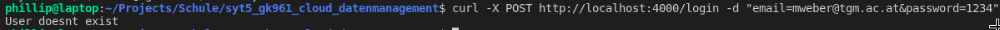
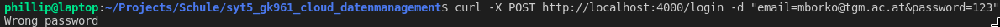
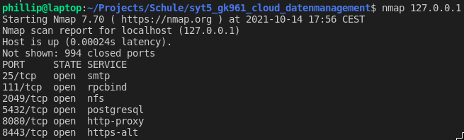

# GK961 Middleware Engineering "Cloud Data-Interface" (BORM)

Die Fragen sind im [QandA](QandA.md) beantwortet.

# Deployment

Git repo clonen. Dann:

```
docker-compose up --build
```

Und dann sollte auf port 8080 bzw. 8443 am Loopback Adapter die REST Schnittstelle verfügbar sein.

# Implementierung

Als erstes hab ich docker-compose installiert. [2]

```bash
sudo curl -L "https://github.com/docker/compose/releases/download/1.29.2/docker-compose-$(uname -s)-$(uname -m)" -o /usr/local/bin/docker-compose

sudo chmod +x /usr/local/bin/docker-compose
```

Dann hab ich mir ein Schema überlegt in welches die Daten passen. Und es in [ddl.sql](./db/ddl.sql) niedergeschrieben. Wobei ich hier mir noch nachforschen musste wie man das ddl.sql automatisch in einem Docker container ausführt. Wobei die Antwort dazu recht einfach war: Man muss das sql skript einfach in den ``/docker-entrypoint-initdb.d/`` Ordner des Containers verschieben um es automatisch auszuführen. [3]

Dann hab ich das Webservice mit nodejs und express geschrieben. Wobei ``express`` es sehr einfach macht Webservices zu schreiben. Zum hashen der Passwörter verwende ich das node package ``bcrypt`` und zum verbinden mit der Datenbank ``postgres``.

Dann hab ich dafür auch ein Dockerfile schreiben müssen wobei ich dieses einfach von [4] übernommen hab.

Als letztes ist dann noch das docker-compose yaml file fällig. Wobei das recht straight forward ist. Man hat zwei Services db und web beschreibt wo sich die Dockerfile's befinden und gibt Umgebungsvariablen sowie Port Mappings mit. Außerdem hab ich noch deklariert das die db vor dem webservice fertig werden soll (depends on). [5]

# Testen

Zum Testen habe ich das Command Line Tool ``curl`` verwendet. ``curl`` ist ein Tool mit dem man Daten zu oder von einem Server übertragen kann wobei folgende Protokolle supportet werden: DICT, FILE, FTP, FTPS, GOPHER, HTTP, HTTPS, IMAP, IMAPS, LDAP, LDAPS, POP3, POP3S, RTMP, RTSP, SCP, SFTP, SMB, SMBS, SMTP, SMTPS, TELNET und TFTP

Außerdem funktioniert es nach abschicken des Befehls ohne user interaktion.

Natürlich hätte man auch mit python und dem ``requests`` package einen Testcase schreiben können.

Die wichtigsten Optionen für meinen UseCase sind.

* -X ... gibt die HTTP Methode (das "Verb" z.b. GET, POST, PUT, ...) an die verwendet werden soll um die request zu machen
* -d ... sendet die mitgegebenen Daten als POST request (wobei es auch mit PUT geht). Der (mime) Content-type ist dann ``application/x-www-form-urlencoded``. z.b. ``-d "name=phillip&email=pprzidal@student.tgm.ac.at"``. Wobei json auch unterstützt wird.

## ``/register``

### Parameter vergessen

Das WebService soll eine Fehlermeldung (HTTP Status Code 4xx) zurückgeben wenn einer der Parameter (name, password, email) fehlt.

curl Befehl:
```bash
curl -X PUT http://localhost:4000/register -d "email=pp@mail.at&password=1234"
```



### email existiert bereits

Das Webservice soll eine Fehlermeldung zurückgeben wenn bereits ein User mit der selben email existiert.

curl Befehle:
```bash
curl -X PUT http://localhost:4000/register -d "name=michaelborko&email=mborko@tgm.ac.at&password=1234"
curl -X PUT http://localhost:4000/register -d "name=michaelborko&email=mborko@tgm.ac.at&password=1234"
```



### Datenbank antwortet nicht

Der Webservice soll einen Fehler melden wenn die Datenbank nicht antwortet (z.b. weil der Container nicht läuft).

curl Befehl und abschießen von der db:
```bash
docker ps -a
docker stop syt_login
curl -X PUT http://localhost:4000/register -d \ "name=michaelborko&email=mborko@tgm.ac.at&password=1234"
```



Hier sieht man das der Container in der die Postgres Datenbank läuft rennt.
Mit ``docker stop syt_login`` kann man das ändern.

Wenn man nun versucht einen neuen User anzulegen sollte eine Fehlermeldung (HTTP Status Code 5xx) kommen.



## ``/login``

Hier gibt es auch die Anforderungen dass das Webservice eine Fehlermeldung zurückgibt wenn nicht alle Parameter (email, password) mitgeschickt werden und das eine Fehlermeldung bei nicht erreichen der Datenbank geschickt wird.
Da dass der gleiche Code wie bei ``/register`` ist spare ich mir hier das testen.

### User existiert nicht

Das Webservice soll einen Fehler (4xx) zurückgeben wenn der user sich mit einer email anmelden möchte die es in der DB nicht gibt.

curl Befehl:
```bash
curl -X POST http://localhost:4000/login -d "email=mweber@tgm.ac.at&password=1234"
```



### User existiert, Passwort falsch

Das Webservice soll einen Fehler zurückgeben wenn die email mit der sich ein user anmelden will zwar in der DB existiert allerdings das passwort falsch eingegeben wurde.

curl Befehl:
```bash
curl -X POST http://localhost:4000/login -d "email=mborko@tgm.ac.at&password=123"
```



### Richtige Email, richtiges Password

Das Webservice soll eine Willkommensnachricht schicken wenn die email und das passwort richtig sind.

curl Befehl:
```bash
curl -X POST http://localhost:4000/login -d "email=mborko@tgm.ac.at&password=1234"
```


## Passwort wird plaintext übertragen! Sicherungsmöglichkeit?

Das steht zwar eigentlich nicht in der Angabe aber ok.

Wie ich schon im [QandA](./QandA.md) geschrieben habe ist in einem Production environment immer HTTPS zu verwenden. Und ich hab nicht gewusst dass das für diese Aufgabe auch von nöten ist.

Dass das Passwort im Plaintext übertragen wird ist richtig, da dass salten und hashen ja vom Server übernommen wird. Will man jetzt aber trotzdem dass das Passwort nicht im Plaintext übertragen wird ist man quasi dazu gezwungen HTTPS zu verwenden.

Aber hier nochmals der Beweis das der Punkt valide ist:

Die App läuft auf Port 8080 (http):



Wenn man nun folgenden Command eingibt zeichnet man alle Packete auf die über das Loopback interface auf Port 8080 gehen oder von da kommen.

```bash
sudo tcpdump port 8080 -nn -i lo -vvv -X
```

Schickt man den Befehl ab und lässt man folgenden Befehl in einem anderen Terminal "reiter" laufen wird die Kommunikation aufgezeichnet.

```bash
curl -k -X POST http://localhost:8080/login \ -d "email=pprzidal@student.tgm.ac.at&password=root123"
```

Man sieht das folgendes Packet geschickt wird:

```bash
18:05:11.771180 IP6 (flowlabel 0xbe850, hlim 64, next-header TCP (6) payload length: 234) ::1.55528 > ::1.8080: Flags [P.], cksum 0x00f2 (incorrect -> 0x53f7), seq 1:203, ack 1, win 512, options [nop,nop,TS val 48400373 ecr 48400373], length 202: HTTP, length: 202
        POST /login HTTP/1.1
        Host: localhost:8080
        User-Agent: curl/7.64.0
        Accept: */*
        Content-Length: 49
        Content-Type: application/x-www-form-urlencoded

        email=pprzidal@student.tgm.ac.at&password=root123[!http]
        0x0000:  600b e850 00ea 0640 0000 0000 0000 0000  `..P...@........
        0x0010:  0000 0000 0000 0001 0000 0000 0000 0000  ................
        0x0020:  0000 0000 0000 0001 d8e8 1f90 0bda 6687  ..............f.
        0x0030:  864b f2b2 8018 0200 00f2 0000 0101 080a  .K..............
        0x0040:  02e2 87f5 02e2 87f5 504f 5354 202f 6c6f  ........POST./lo
        0x0050:  6769 6e20 4854 5450 2f31 2e31 0d0a 486f  gin.HTTP/1.1..Ho
        0x0060:  7374 3a20 6c6f 6361 6c68 6f73 743a 3830  st:.localhost:80
        0x0070:  3830 0d0a 5573 6572 2d41 6765 6e74 3a20  80..User-Agent:.
        0x0080:  6375 726c 2f37 2e36 342e 300d 0a41 6363  curl/7.64.0..Acc
        0x0090:  6570 743a 202a 2f2a 0d0a 436f 6e74 656e  ept:.*/*..Conten
        0x00a0:  742d 4c65 6e67 7468 3a20 3439 0d0a 436f  t-Length:.49..Co
        0x00b0:  6e74 656e 742d 5479 7065 3a20 6170 706c  ntent-Type:.appl
        0x00c0:  6963 6174 696f 6e2f 782d 7777 772d 666f  ication/x-www-fo
        0x00d0:  726d 2d75 726c 656e 636f 6465 640d 0a0d  rm-urlencoded...
        0x00e0:  0a65 6d61 696c 3d70 7072 7a69 6461 6c40  .email=pprzidal@
        0x00f0:  7374 7564 656e 742e 7467 6d2e 6163 2e61  student.tgm.ac.a
        0x0100:  7426 7061 7373 776f 7264 3d72 6f6f 7431  t&password=root1
        0x0110:  3233                                  
```

Nun habe ich erstmal drei neue npm Packages installiert die für https notwendig werden nämlich fs, http, https:

```
npm install fs
npm install http
npm install https
```

http und https verwenden dann express als middleware, wobei https als ersten Parameter noch ein Dictionary hat welches die keys: key und cert hat. Genau hier kommt dann das fs (steht für filesystem) Package ins spiel: Und zwar soll für key und cert die jeweiligen Strings provided werden. Da diese Strings in files gespeichert sind müssen wir sie mit der Methode readFileSync aus dem File auslesen. Wobei diese Methode blockierend liest also KEINEN Promise returnd sondern den Content des files.

Allerdings müssen das Certificate und der Key noch geniert werden. Hierzu habe ich folgenden Command verwendet [6]:

```bash
openssl req -x509 -nodes -days 365 -newkey rsa:2048 -keyout ./selfsigned.key -out selfsigned.crt
```

Wobei man dann via stdin noch ein paar Sachen gefragt wird (Land, Stadt, Organization name, email, usw...).

Diese beiden Dateien werden dann in den Container kopiert.

https wird von der nodejs dann auf Port 8443 angeboten wobei wobei im Docker sowie Dockercompose file noch geschrieben stehen muss das diese Ports exposed werden.

Macht man nun folgenden tcpdump:

```bash
sudo tcpdump port 8443 -nn -i lo -vvv -X
```

Und macht folgenden curl:

```bash
curl -k -X POST https://localhost:8443/login -d "email=pprzidal@student.tgm.ac.at&password=root123"
```

Merkt man das der filter den wir für den tcpdump definiert haben nicht mehr nur 20 sondern sogar 36 Packete abfängt. Wobei der Inhalt der Packete nicht mehr im plaintext ist.

# Quellen

[1]     "man curl";[kein Link]();10.10.2021

[2]     "docker-compose installieren";[Link](https://docs.docker.com/compose/install/);10.10.2021

[3]     "docker postgres run sql file on "startup"";[Link](https://stackoverflow.com/questions/26598738/how-to-create-user-database-in-script-for-docker-postgres);10.10.2021

[4]     "dockerize a nodejs app";[Link](https://nodejs.org/de/docs/guides/nodejs-docker-webapp/);10.10.2021

[5]     "docker compose";[Link](https://docs.docker.com/samples/django/);10.10.2021

[6]     "https with nodejs & express stackoverflow";[Link](https://stackoverflow.com/questions/11744975/enabling-https-on-express-js); 14.10.2021